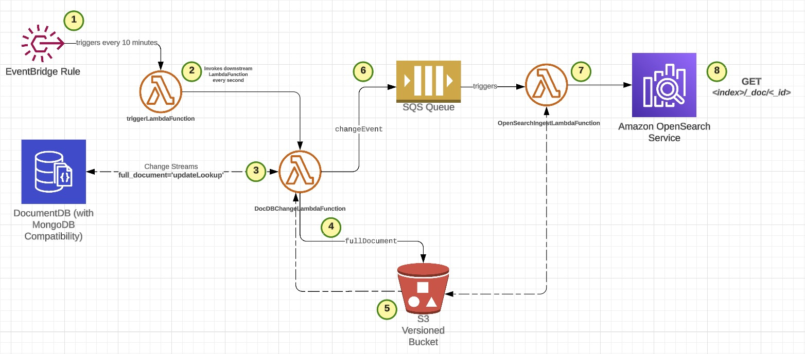

# aws-opensearch-docdb-change-streams
Deploy Amazon OpenSearch + DocumentDB and ensure changes in DocumentDB are applied near real-time to OpenSearch, using Change Streams.



### Workflow:

1. An EventBridge rule triggers the `triggerLambdaFunction`, once every 10 minutes. This is a workaround as EventBridge rules cannot be configured less than 1 minute.

2. The `triggerLambdaFunction` then invokes the `DocDBChangeLambdaFunction`, every second for 10 minutes, before it times out and another instance gets triggered by Step 1, to take on invocations every second for the next 10 minutes. One of the project requirements were to check every second for changes on DocumentDB to keep OpenSearch updated.

3. `DocDBChangeLambdaFunction` Lambda function checks DocumentDB for changes and requests a `full_document` in the response, using `full_document='updateLookup'` in the request. This ensures DocumentDB responds with the updated state of the document as-is at the time on DocumentDB.

4. `DocDBChangeLambdaFunction` then takes the response for each change and writes the `full_document` section of the change stream to a versioned S3 Bucket. 

5. Amazon S3 responds back with a success/failure status along with metadata on the S3 Object location and `VersionId`. This information is written into `s3Metadata` to be used downstream.

6. `DocDBChangeLambdaFunction` then proceeds to **replace** the `full_document` section with the new `s3Metadata` of the full_document to ensure we do not exceed the **1 MB** message size limit of Amazon SQS. The now modified payload is pushed to an Amazon SQS FIFO Queue to ensure changes are consistent when they are applied on OpenSearch to avoid basic race conditions on queries with OpenSearch. The new change stream event should look like this

```json
{
    "_id": {
        "_data": "016478047e00000001010000000100004302"
    },
    "operationType": "insert",
    "clusterTime": {
        "$timestamp": {
            "t": 1685587070,
            "i": 1
        }
    },
    "ns": {
        "db": "sampledb",
        "coll": "tweets"
    },
    "documentKey": {
        "_id": {
            "$oid": "6478047e6fdfa18915d3b7e2"
        }
    },
    "s3Metadata": {
        "bucketName": "documentdb-opensear-s3bucketstreamingdata-1js807ywh8285",
        "s3ObjectKey": "sampledb/tweets/2023/06/03/6478047e6fdfa18915d3b7e2",
        "s3ObjectVersionId": "elPq4C796rDO.sKukuvsroRM9VuenaQo",
        "database": "sampledb",
        "collection": "tweets",
        "docId": "6478047e6fdfa18915d3b7e2"
    }
}
```

7. A message on the Amazon SQS FIFO Queue triggers the `OpenSearchIngestLambdaFunction` to read messages as they come in and perform necessary data transformations before writing the changes into OpenSearch.

8. Now the application is able to query OpenSearch and get results with the new changes on DocumentDB.

### Build

To replicate the same setup, follow these steps -

1. Upload the GitHub repository contents onto an S3 BUCKET, hereinafter referred to as `S3_CLOUDFORMATION_BUCKET`.

2. Run the CloudFormation template provided within `cloudformation` folder, passing the following parameters as needed.

| Key | Value|
| --- | ---- | 
| DocDBIdentifier | documentdb |
| DocDBPassword | **** |
| DocDBUsername |	docDBUser |
| ExistingCloud9Role | false |
| SQSTimeout | 60 |
| TriggerLambdaInterval | 1 |
| TriggerLambdaTimeout | 600 |

> Follow the next steps if you make changes to the AWS Lambda function code written in Python.

3. Update `package.sh` with the `S3_CLOUDFORMATION_BUCKET` bucket name you created from Build Step 1 and `S3_LAMBDA_BUCKET` with the  `S3BucketName` from the CloudFormation Outputs section.

4. Running `package.sh`
    - to package our Lambda function code
    - upload the packaged zip files to `S3_LAMBDA_BUCKET`
    - any changes to the CloudFormation template would also be uploaded to `S3_CLOUDFORMATION_BUCKET`.

5. Ensure the Lambda functions are using the latest version of the code from the `S3_LAMBDA_BUCKET`.